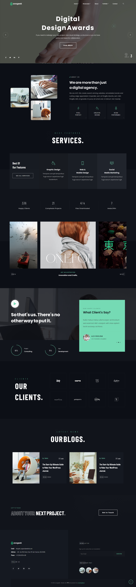

<p align="center">
  <a href="https://avogeek.netlify.app">
    
    <h2 align="center">Avogeek</h2>
  </a>
</p> 
<p align="center">Creative Portfolio & Agency Theme</p>

[](https://app.netlify.com/sites/avogeek/deploys)


## [Live Demo](https://avogeek.netlify.app)

# Homepage

<a href="https://avogeek.netlify.app"></a>

_NOTE: If you are using this site as a template for your own portfolio site, I would be very glad if you add a link to the original site with my name in footer_

## :rocket: Quick start

**Run the site locally**

_NOTE: The default branch for this repo is `master`, when you push or pull make sure you specify the correct branch_

### Step 1: Clone The Repo

Fork the repository. then clone the repo locally by doing -

```bash
git clone https://github.com/uiuxarghya/avogeek.git
```

### Step 2: Start Live Server

Then start the Live Server

```
Alt + L Alt + O
```

After running the live server the site should be running on http://localhost:5500/

## :open_file_folder: What's inside?

A quick look at the folder structure of this project.

    .
    ├── index.html
    ├── pages
    ├── css
    ├── js
    ├── img
    ├── fonts
    ├── about
    └───contact

## :cyclone: Languages Used

1. HTML5
2. CSS3
3. JavaScript

## :wrench: Tools Used

1. [VS Code](https://code.visualstudio.com/) (_editor_)
2. [GitHub](https://github.com/) (_for version control_)
3. [Netlify](https://netlify.com/) (_CDN and hosting_)

## 💫 Deply Now

[](https://vercel.com/new/git/external?repository-url=https%3A%2F%2Fgithub.com%2Fuiuxarghya%2Favogeek&project-name=avogeek&repository-name=avogeek)

[](https://app.netlify.com/start/deploy?repository=https://github.com/uiuxarghya/avogeek&utm_source=github)

# Copyright & License

Copyright (c) 2020 uiuxarghya - Released under the [MIT license](LICENSE).


Made with :heart: and passion by uiuxarghya
